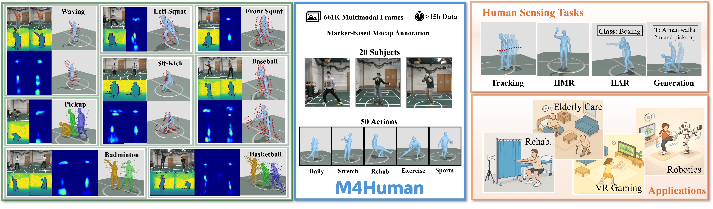
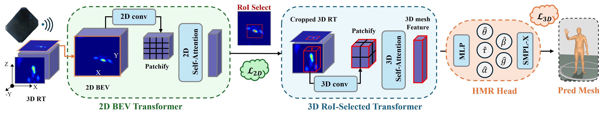

<div align="center">

# M4Human: A large-scale Multimodal mmWave Radar-based 3D Human Mesh Estimation Benchmark
This repository contains Mtraining and evaluation code for 3D human mesh estimation from mmWave data.

</div>

<div align="center">


[](#4-environment)
[](https://entuedu-my.sharepoint.com/:f:/g/personal/fanj0019_e_ntu_edu_sg/IgCnjZ9_aIjpSa6tin8aDz-FAX46Jv3kf-n1ji-q7LwAC7s?e=SQVigW)
[](https://arxiv.org/pdf/2512.12378)
[](https://fanjunqiao.github.io/M4Human-site/)

</div>

<p align="center">

</p>
Overview of `M4Human`, the `largest` multimodal dataset for high-fidelity mmWave radar-based human motion sensing. It covers diverse free-space motions (e.g., rehabilitation, exercise, and sports) beyond simple in-place actions, with high-quality marker-based motion annotations. Such diversity supports a broad range of human sensing tasks, including tracking, human mesh recovery, action recognition, and human motion generation, as well as privacy-preserving applications in elderly care, rehabilitation, robotics, and VR gaming.


## News 🔥

M4Human is released! The largest-scale multimodal mmWave human mesh benchmark, code and dataset will be available after paper publication.

- Supported modalities in current code:
`radar_points (Radar Point Cloud (RPC))`, `rawImage_XYZ (Radar Tensor (RT))`
- Supported model names in current code:
`P4Transformer (RPC)` , `RT-Mesh (RT)`, `RETR (RT)`
- Clear dataset split configuration is read through `dataset/dataset_config_clean.py`.
- Distributed training and evaluation are supported via `torchrun`. (Click and Run)

## 1. Abstract

Human mesh reconstruction (HMR) provides direct insights into body-environment interaction, which enables various immersive applications. While existing large-scale HMR datasets rely heavily on line-of-sight RGB input, vision-based sensing is limited by occlusion, lighting variation, and privacy concerns. To overcome these limitations, recent efforts have explored radio-frequency (RF) mmWave radar for privacy-preserving indoor human sensing. However, current radar datasets are constrained by sparse skeleton labels, limited scale, and simple in-place actions.

To advance the HMR research community, we introduce M4Human, the current largest-scale (661K-frame) (9 times prior largest) multimodal benchmark, featuring high-resolution mmWave radar, RGB, and depth data. M4Human provides both raw radar tensors (RT) and processed radar point clouds (RPC) to enable research across different levels of RF signal granularity. M4Human includes high-quality motion capture (MoCap) annotations with 3D meshes and global trajectories, and spans 20 subjects and 50 diverse actions, including in-place, sit-in-place, and free-space sports or rehabilitation movements. We establish benchmarks on both RT and RPC modalities, as well as multimodal fusion with RGB-D modalities. Extensive results highlight the significance of M4Human for radar-based human modeling while revealing persistent challenges under fast, unconstrained motion. The dataset and code will be released after the paper publication.

## 2. Method Overview

The training loop predicts SMPL-X parameters (root center, root orientation, body shape, body pose, gender), from a sequence of T=4 frames radar inputs (RPC or RT).

- Input temporal length is controlled by `temporal_window` in `dataset/m4human_dataset.py`.
- Supervision is currently single-frame SMPL-X parameter.
- Evaluation aggregates metrics over 50 actions.

<p align="center">

</p>
Overview of the proposed RT-Mesh baseline. Given a 3D radar tensor (RT), RT-Mesh first reshapes it into a 2D BEV representation. A lightweight 2D BEV Transformer, combining 2D convolution and self-attention, performs efficient 2D human localization $(\hat{x},\hat{y})$ under the supervision of $\mathcal{L}_{2D}$. A local 3D RoI is cropped from the full RT volume based on $(\hat{x},\hat{y})$, which is then processed by 3D convolution and 3D Transformer to extract fine-grained 3D mesh features. Finally, an HMR head regresses SMPL-X parameters for 3D mesh.


## 3. Repository Structure

```text
M4Human-main/                                       
|-- config.yaml                                     # Dataset Benchmark config *
|-- main1_multigpu_clean.py                         # Main code *
|-- dataset/                                        # Dataset Setup code
|   |-- m4human_dataset.py
|   |-- m4human_utils.py
|   |-- dataset_config_clean.py
|   |-- lmdb_utils.py
|-- mmwave_models/                                  # Models
|   |-- Point_models/
|   |-- Tensor_models/
|       |-- RTmesh/
|       |-- retr_models/
|-- sources/
|   |-- Train_and_model_loss.py                     # Loss Definition
|   |-- evaluation_module_pc_multigpu.py            # Evaluation utilities
|   |-- Train_and_model_plotting_3D_mesh.py         # Plotting functions
|-- models/smplx/
|-- experiments/
```


## Click&Run (Step 1.1): Environment Setup

We test our code in the following environment:

```text
Ubuntu 20.04
Python 3.9
PyTorch 2.2.0
CUDA 11.8
```

Create the environment using:

```bash
conda env create -f environment.yml
```

Our point-based method requires CUDA PointNet++ acceleration. Follow the setup instructions in the P4Transformer dependency: https://github.com/erikwijmans/Pointnet2_PyTorch. RT-based does not require CUDA setup.

## Click&Run (Step 1.2): SMPL Models Setup

- Download SMPL models from official source or `https://smpl-x.is.tue.mpg.de/`.
- Place them under `models/smplx/`.

```text
M4Human-main/
    models/
        smplx/
            SMPLX_FEMALE.npz
            SMPLX_FEMALE.pkl
            SMPLX_MALE.npz
            SMPLX_MALE.pkl
            SMPLX_NEUTRAL.npz
            SMPLX_NEUTRAL.pkl
            smplx_npz.zip
            version.txt
```

Current code reads `.npz` files from `config.yaml -> paths.smplx`.

## Click&Run (Step 2): Download Datasets

- Full raw dataset (around 2T zip files): `[https://entuedu-my.sharepoint.com/:f:/g/personal/fanj0019_e_ntu_edu_sg/IgA0WpGdboi7QJ_pz9LW-QRUAeoMWwFY2H00yNQcYoxDp4c?e=xcgxmY] Partially Uploaded`
<!-- - Full processed dataset: `[URL] Comming Soon` -->
- Full processed dataset (radar modality)  (Recommend, around 50G LMDB files): `[https://entuedu-my.sharepoint.com/:f:/g/personal/fanj0019_e_ntu_edu_sg/IgCnjZ9_aIjpSa6tin8aDz-FAX46Jv3kf-n1ji-q7LwAC7s?e=SQVigW] Here`

After downloading processed dataset, organize folders (recommended outside repo):

```text
M4Human-main/                      # Main repo folder
mmDataset/                         # (Full processed dataset)
    MR-Mesh/
        rf3dpose_all/
            calib.lmdb
            radar_comp.lmdb        # (RT)
            radar_comp.lmdb-lock
            radar_pc.lmdb          # (RPC)
            radar_pc.lmdb-lock
            params.lmdb            # (GT params)
            indeces.pkl.gz         # (dataset split configuration)
            ... (other .lmdb and lmdb-lock files)
```

Training cache path is configured by `config.yaml`:

```yaml
paths:
  cached_root: '../mmDataset/MR-Mesh/'
```

Expected LMDB set in loader:

```text
<cached_root>/rf3dpose_all/
|-- radar_comp.lmdb
|-- radar_pc.lmdb
|-- params.lmdb
|-- calib.lmdb
|-- indicator.lmdb
|-- image.lmdb            # currently not support due to large image modality size, set use_image=True to load image modality.
|-- indeces.pkl.gz
```


## Click&Run (Step 3): Check Experiment Configuration (`config.yaml`)

Benchmark behavior is controlled by `config.yaml`. 

| Key | Meaning | Typical Values |
|---|---|---|
| `model.name` | Model selector | `P4Transformer`, `RT-Mesh`, `RETR` |
| `model.modality` | Input modality key | `radar_points`, `rawImage_XYZ` |
| `train.batch_size` | Per-process batch size | e.g. `64` |
| `train.lr` | Adam LR | e.g. `2e-4` |
| `train.loss_weights.*` | Weighted terms in `combined_loss` | float |
| `eval.test_mode` | Evaluation-only mode | `true/false` |
| `eval.plot_gif` | Save GIF during eval | `true/false` |
| `dataset.protocol` | Ratio protocol | `p1`, `p2`, `p3` |
| `dataset.split` | Split strategy | `s1`, `s2`, `s3` |

Valid model-modality combinations:

- `radar_points` + `P4Transformer`
- `rawImage_XYZ` + `RT-Mesh`
- `rawImage_XYZ` + `RETR`

Per sample from `dataset/m4human_dataset.py`:

- `rawImage_XYZ`: temporal radar tensor sequence
- `radar_points`: temporal padded radar point cloud
- `parameter`: SMPL-X parameters in radar frame
- `vertices`: generated mesh vertices
- `joints_root`: root and selected joints
- `bbbox`: AABB from params
- `projected_vertices`: 2D projected vertices
- `indicator`: `[sub_id, act_id, frame_id]`
- `calibration`: calibration dict

Notes:
- Protocol is different from (IP, SIP, NIP) in main paper, controlling how much porpotion of dataset is used. For example, we can choose 'p3' with 25% of subjects for fast training and evaluating (see dataset size VS performance in Fig. 5 (main paper)). (IP, SIP, NIP) are directly reported in the results table.
- Point modality applies z-offset normalization (`-1.5`) in dataset loader.
- Input uses temporal context (`temporal_window` in `dataset/m4human_dataset.py`), while supervision is single-frame.

## Click&Run (Step 4): Benchmarking (Radar Modality Only)

To train the benchmark: (Modify GPU num, currently 4)

```bash
torchrun --nproc_per_node=4 main1_multigpu_clean.py
```

To test the pretrained model:

```yaml
eval:
  test_mode: true
  test_model_path: './experiments/exp_xxx/best_model_epoch_x.pth' # final best one
```

Then run again

```bash
torchrun --nproc_per_node=4 main1_multigpu_clean.py
```


## Outputs

Outputs are saved to `experiments/exp_YYYYMMDD_HHMMSS/`:

- `train_test.log`
- `results.csv`
- `results_best.csv`
- `best_model_epoch*.pth`
- `test_epoch_*/`


Our benchmark reports:

- Mean vertex error (MVE)
- Mean joint localization error (MJE)
- Mean joint rotation error (degree) (MRE)
- Mean mesh localization error (TE)
- Mean gender accuracy (Gender Acc)

Metrics are aggregated per action.

## Citation

If this project helps your research, please cite your paper here:

```bibtex
@article{fan2025m4human,
  title={M4Human: A Large-Scale Multimodal mmWave Radar Benchmark for Human Mesh Reconstruction},
  author={Fan, Junqiao and Zhou, Yunjiao and Yang, Yizhuo and Cui, Xinyuan and Zhang, Jiarui and Xie, Lihua and Yang, Jianfei and Lu, Chris Xiaoxuan and Ding, Fangqiang},
  journal={arXiv preprint arXiv:2512.12378},
  year={2025}
}
```

## Acknowledgements

- PyTorch ecosystem
- Related mmWave and human mesh estimation projects

<!-- ## 13. Appendix: Original README Items Preserved

This file intentionally preserves all original README points:

- Environment creation via `environment.yml`
- PointNet++ acceleration note and dependency link
- Dataset download status and sample link
- Original dataset folder examples
- SMPL model placement instructions
- `demo.ipynb` / visualization mention
- Original benchmark command via `main1_multigpu.py`
- Original note: RGBD support will be released after further organization

Demo & visualization note from original README:

- We provide `demo.ipynb` for dataset visualization, modality GIF generation to `vis_depth/`, and preprocessed radar dataloader tutorial.
- For more details, see comments in code and notebook.

Original RGBD note:

- RGBD support will be released after further organization.

Media placeholders to fill later:

- `assets/teaser.gif`
- `assets/pipeline_overview.png`
- Additional qualitative GIF/video links as needed -->


<!-- ## 7. Sample Vis Dataset

- Sample Vis dataset: https://entuedu-my.sharepoint.com/:f:/g/personal/fanj0019_e_ntu_edu_sg/IgDSzyJNtxJYRZn3lXtWjaM7AYSyj3p1IH0h2ziGGREplO0?e=d1Y85Y

Recommended folder layout:

```text
cached_data_test_vis/
  rf3dpose_all/
    calib.lmdb
    image.lmdb               # vis dataset provide subset of raw images
    depth.lmdb               # vis dataset provide subset of raw depths
    radar_pc.lmdb
    params.lmdb
    indeces.pkl.gz
    ... (other .lmdb and .lock files)
```

Sample Vis quick setup:

```bash
cd ..
mkdir cached_data_test_vis
mv rf3dpose_all.zip cached_data_test_vis/
cd cached_data_test_vis/
unzip rf3dpose_all.zip
``` -->


